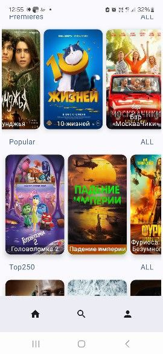
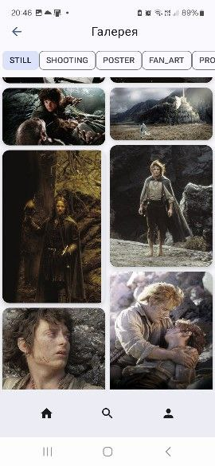

# Cinema World
## Android приложение клон кинопоиска

#### _Поддержка офлайн-режима_
#### _Для сетевого взаимодействия используется открытое API  - <code>[kinopoisk](https://kinopoiskapiunofficial.tech/)</code>_

## Реализованные фичи:
### 1. Главный экран - подборка списков фильмов по категориям Премьеры, Популярные, Топ - 250 , Сериалы. 

### 2. Просмотр информация по фильму. Списки актёров, галерея фотоснимков и похожие фильмы.

  

### 3. Возможность локально создавать свои коллекции фильмов. 

### 4. Поиск фильмов и актёров 

  

### 5. Галлерея снимков по разным категориям  - За кадром, Постеры, Скриншоты, Фан Арт.

### 6. Информация об Актёрах и актрисах и фильмах в которых снимался

## Стек технологий:
- язык программирования Kotlin
- UI на Jetpack Compose 
- Single Activity Application паттерн
- MVVM в презентационном слое на AAC (ViewModel + StateFlow)
- навигация Jetpack Navigation
- Paging 3 , пагинация.
- SwipeRefresh, Acomponist.
- Многомодульность
- Dagger Hilt в качестве DI для организации архитектуры приложения
- Kotlin Coroutines для асинхронных операций + Flow
- Retrofit + Kotlin Serialization для сетевого взаимодействия
- Room для БД
- 5 unit-тестов для фич
- 1 UI-тест 

## Многомодульность (14 модулей)

## Схема БД

## Дальнейшее развитие
1) Реализация фичей
    - Фильтры к поиску
    - просмотр коллекций фильмов, сортировка и очистка коллекции
    - увеличение фото жестами. 
2) Dagger Free Di подход
3) Перевод Room на KSP
4) Все в Compose
5) Jetpack Compose Navigation
6) Модернизировать дизайн
